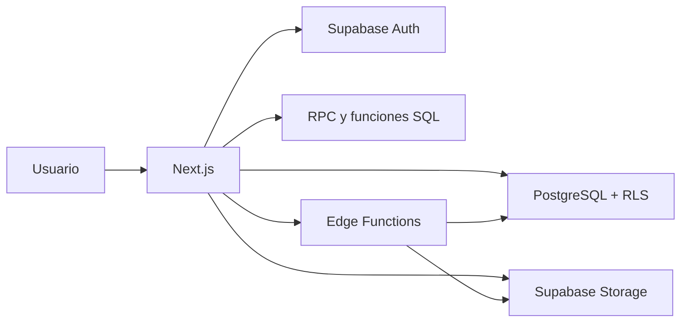

# FitManager

SaaS multi-tenant para la administración de gimnasios pequeños. FitManager centraliza miembros, planes, membresías, cargos, pagos, morosidad, entradas, personal y reportes en una sola plataforma.

El proyecto está orientado inicialmente a gimnasios de Nicaragua con aproximadamente 25 a 100 miembros y una operación diaria administrada desde recepción.

> Estado del proyecto: en desarrollo. La arquitectura base de Supabase ya fue definida y el equipo se encuentra preparando el primer flujo vertical del MVP.

## Objetivo

FitManager busca reemplazar procesos dispersos en papel, hojas de cálculo y mensajería por una plataforma sencilla que permita:

- Registrar y consultar miembros.
- Administrar planes y membresías.
- Generar cargos y registrar pagos.
- Identificar membresías vencidas y miembros morosos.
- Registrar entradas al gimnasio.
- Gestionar usuarios, roles y permisos.
- Consultar ingresos y reportes básicos.
- Mantener separación estricta entre gimnasios.

## Funciones del MVP

- Registro y configuración de gimnasios.
- Soporte para múltiples sucursales.
- Usuarios, roles y permisos.
- Registro, edición y búsqueda de miembros.
- Fotografías mediante Supabase Storage.
- Planes y suscripciones de membresía.
- Estados, vencimientos y cancelaciones.
- Cargos, pagos, recibos y morosidad.
- Operación en USD y NIO.
- Registro de entradas.
- Ingresos y caja básica.
- Dashboard y reportes esenciales.
- Auditoría de operaciones importantes.
- Borrado lógico en entidades administrativas.
- Aislamiento multi-tenant mediante Row Level Security.

## Fuera del MVP

- Aplicación móvil nativa.
- Rutinas y nutrición.
- Nómina y contabilidad completa.
- Inventario avanzado.
- Portal para entrenadores.
- Control físico automático de puertas.
- Funciones para grandes cadenas.
- Portal propio para miembros, hasta que se apruebe como parte del alcance.
- Reconocimiento facial como dependencia obligatoria del flujo de entrada.

## Tecnologías

### Frontend

- [Next.js](https://nextjs.org/) con App Router.
- React.
- TypeScript y TSX.
- Tailwind CSS.
- Zod para validación de formularios y contratos.
- Vercel para el despliegue inicial.

### Backend y servicios

- [Supabase](https://supabase.com/) como backend principal.
- PostgreSQL administrado por Supabase.
- Supabase Auth.
- Supabase Storage privado.
- Row Level Security.
- Funciones PostgreSQL y RPC.
- Triggers y vistas seguras.
- Edge Functions para procesos privilegiados o integraciones.
- `pgvector` para funciones biométricas futuras.

## Arquitectura



La aplicación utiliza una arquitectura Supabase-first. El frontend puede realizar operaciones simples directamente contra Supabase cuando están protegidas por RLS. Las operaciones sensibles o complejas deben ejecutarse mediante RPC, Server Actions, Route Handlers o Edge Functions.

## Multi-tenancy

Cada gimnasio funciona como un tenant independiente.

Toda entidad comercial debe pertenecer a un gimnasio mediante `gym_id` o una relación verificable con otra entidad que lo contenga.

La seguridad multi-tenant no depende de filtros del frontend. Se aplica mediante:

- Supabase Auth.
- Row Level Security.
- Permisos por rol.
- Funciones seguras de PostgreSQL.
- Validaciones en el servidor.
- Auditoría de acciones críticas.

Un usuario de un gimnasio no debe poder consultar ni modificar información de otro gimnasio.

## Roles iniciales

| Rol | Alcance general |
|---|---|
| Dueño | Administración completa de su gimnasio, personal, configuración y reportes. |
| Gerente | Operaciones y reportes autorizados, sin propiedad de la cuenta SaaS. |
| Recepcionista | Miembros, membresías, cobros y entradas con acceso financiero limitado. |
| Administrador de plataforma | Administración interna del SaaS, soporte y auditoría. |

La autorización se basa en códigos de permisos y no solamente en el nombre del rol.

## Estructura recomendada

```text
fitmanager/
├── app/                     # Rutas y páginas de Next.js
├── components/              # Componentes reutilizables
├── features/                # Módulos por dominio
├── lib/
│   ├── supabase/            # Clientes de navegador y servidor
│   ├── validations/         # Esquemas Zod
│   └── utils/               # Utilidades compartidas
├── public/                  # Recursos estáticos
├── supabase/
│   ├── migrations/          # Migraciones SQL versionadas
│   ├── functions/           # Edge Functions
│   └── seed.sql             # Datos de desarrollo, si aplica
├── docs/                    # Decisiones y documentación
├── AGENTS.md                # Reglas técnicas para agentes
├── README.md
└── package.json
```

La estructura puede cambiar a medida que avance el proyecto. Las reglas de negocio no deben colocarse directamente dentro de componentes React.

## Requisitos

Antes de ejecutar el proyecto se necesita:

- Node.js 20 o superior.
- npm, pnpm o yarn.
- Una cuenta y un proyecto de Supabase.
- Supabase CLI para desarrollo local y migraciones.
- Git.

## Instalación

Clona el repositorio:

```bash
git clone <URL_DEL_REPOSITORIO>
cd fitmanager
```

Instala las dependencias:

```bash
npm install
```

Crea el archivo de variables de entorno:

```bash
cp .env.example .env.local
```

Configura como mínimo:

```env
NEXT_PUBLIC_SUPABASE_URL=https://tu-proyecto.supabase.co
NEXT_PUBLIC_SUPABASE_ANON_KEY=tu_clave_publica
```

Las operaciones privilegiadas pueden requerir variables adicionales en el servidor:

```env
SUPABASE_SERVICE_ROLE_KEY=tu_clave_privada
```

> `SUPABASE_SERVICE_ROLE_KEY` nunca debe utilizarse en componentes del cliente, variables `NEXT_PUBLIC_*`, commits, logs ni ejemplos públicos.

Inicia el entorno de desarrollo:

```bash
npm run dev
```

Abre [http://localhost:3000](http://localhost:3000).

## Supabase local

Inicializa Supabase CLI si todavía no está configurado:

```bash
supabase init
```

Inicia los servicios locales:

```bash
supabase start
```

Aplica las migraciones desde cero en el entorno local:

```bash
supabase db reset
```

Crea una nueva migración:

```bash
supabase migration new nombre_de_la_migracion
```

Compara el esquema remoto cuando sea necesario:

```bash
supabase db diff
```

Vincula el proyecto local con Supabase remoto:

```bash
supabase link --project-ref <PROJECT_REF>
```

Aplica migraciones pendientes al proyecto vinculado:

```bash
supabase db push
```

No se debe modificar producción únicamente desde SQL Editor. Todo cambio debe conservarse como una migración incremental dentro del repositorio.

## Migraciones

Las migraciones se almacenan en:

```text
supabase/migrations/
```

Reglas principales:

- No modificar una migración que ya fue aplicada en producción.
- Crear una migración incremental para cada cambio.
- Revisar tablas, índices, restricciones, funciones, triggers, políticas RLS y permisos.
- Probar los cambios localmente antes de aplicarlos al entorno remoto.
- Verificar el acceso con usuarios de diferentes gimnasios.
- Documentar cualquier operación destructiva o irreversible.

## Supabase Storage

Las imágenes y archivos se almacenan como objetos en Supabase Storage. PostgreSQL conserva solamente sus metadatos y referencias.

El bucket principal es privado y las rutas deben comenzar con el identificador del gimnasio:

```text
<gym_id>/<categoria>/<identificador>/<archivo>
```

Ejemplo:

```text
<gym_id>/members/<member_id>/<uuid>.webp
```

No se deben guardar imágenes como `bytea`, Base64 o contenido binario dentro de JSON.

## Operaciones sensibles

Las siguientes operaciones no deben depender únicamente del navegador:

- Aplicación o anulación de pagos.
- Generación de cargos.
- Cancelación de membresías.
- Cambios de roles y permisos.
- Procesos con `service_role`.
- Eliminación física de archivos.
- Procesamiento biométrico.
- Integraciones con servicios externos.

Para estos casos se deben utilizar RPC, Server Actions, Route Handlers, Edge Functions o servicios confiables.

## Dinero y monedas

FitManager soportará USD y NIO.

Reglas monetarias:

- No utilizar `float` o `double` para dinero.
- PostgreSQL debe utilizar tipos `numeric` adecuados.
- Cada transacción debe guardar monto y moneda.
- Una conversión debe guardar la tasa aplicada.
- Cambiar la tasa solo afecta transacciones nuevas.
- Las transacciones históricas no deben recalcularse.
- Los pagos no se eliminan físicamente; se anulan o corrigen mediante operaciones auditadas.

La tasa inicial de referencia propuesta es C$36.50 por US$1 y cada gimnasio podrá administrarla cuando la regla quede implementada.

## Borrado lógico

Las entidades administrativas pueden utilizar borrado lógico mediante campos como:

- `deleted_at`.
- `deleted_by`.
- `deletion_reason`.

Los registros financieros e históricos no deben eliminarse físicamente.

Esto incluye:

- Pagos.
- Cargos.
- Suscripciones.
- Ingresos.
- Eventos de entrada.
- Alertas.
- Auditorías.

## Seguridad

Principios mínimos del proyecto:

- RLS en toda tabla expuesta.
- Validación de autorización en cada operación.
- Secretos fuera del repositorio.
- Storage privado.
- Validación de archivos, tamaño y MIME.
- Protección contra XSS, CSRF e inyección.
- HTTPS en ambientes con datos reales.
- Auditoría de operaciones críticas.
- Respaldos y restauración probados antes del piloto.
- Pruebas explícitas de aislamiento entre gimnasios.

## Flujo vertical inicial

El primer recorrido completo del MVP será:

1. Crear o seleccionar un gimnasio.
2. Registrar un miembro.
3. Asignar un plan de membresía.
4. Generar el cargo correspondiente.
5. Registrar y aplicar un pago.
6. Consultar el estado de la membresía.
7. Registrar la entrada del miembro.
8. Verificar que otro gimnasio no pueda acceder a esos datos.

Este flujo debe funcionar correctamente antes de ampliar el alcance con reconocimiento facial u otros módulos avanzados.

## Scripts

Los scripts disponibles dependen del estado actual del repositorio. Los más comunes son:

```bash
npm run dev        # Desarrollo
npm run build      # Compilación de producción
npm run start      # Ejecutar compilación
npm run lint       # Análisis estático
npm run test       # Pruebas, cuando estén configuradas
```

Consulta `package.json` para conocer los comandos vigentes.

## Flujo de trabajo

1. Seleccionar una tarjeta concreta del tablero de Trello.
2. Revisar `AGENTS.md` y las decisiones relacionadas.
3. Confirmar que la tarea pertenece al MVP.
4. Revisar el estado del repositorio.
5. Implementar el cambio sin sobrescribir trabajo ajeno.
6. Agregar pruebas proporcionales al riesgo.
7. Verificar el recorrido real.
8. Actualizar documentación y migraciones.
9. Mover la tarjeta solamente cuando cumpla su criterio de terminado.

El tablero real de Trello es la fuente de verdad para responsables, prioridades, bloqueos y estado de las tareas.

## Estado del proyecto

Actualmente el proyecto se encuentra en preparación del MVP.

Prioridades inmediatas:

- Validar el problema con dueños y gerentes de gimnasios.
- Cerrar las reglas de membresías, cargos y pagos.
- Versionar correctamente las migraciones de Supabase.
- Preparar autenticación y selección del gimnasio activo.
- Crear la matriz inicial de permisos.
- Implementar el primer flujo vertical.
- Probar aislamiento con al menos dos gimnasios.

## Contribución

Antes de colaborar:

1. Lee `AGENTS.md`.
2. Trabaja únicamente sobre una tarjeta asignada o aprobada.
3. No cambies la arquitectura sin una decisión explícita.
4. No incluyas credenciales ni datos reales.
5. Agrega una migración para todo cambio de esquema.
6. Verifica RLS y multi-tenancy.
7. Documenta las pruebas ejecutadas.

Las ramas pueden seguir una convención como:

```text
feature/nombre-corto
fix/nombre-corto
chore/nombre-corto
```

Los commits pueden seguir Conventional Commits:

```text
feat: agregar registro de miembros
fix: impedir acceso entre gimnasios
chore: versionar migraciones iniciales
```

## Licencia

Este proyecto es privado. No se concede permiso para usar, copiar, modificar o distribuir el código sin autorización expresa de sus propietarios.

---

FitManager se encuentra en desarrollo activo. La documentación debe actualizarse a medida que se cierren decisiones del producto y se implementen nuevas funciones.
